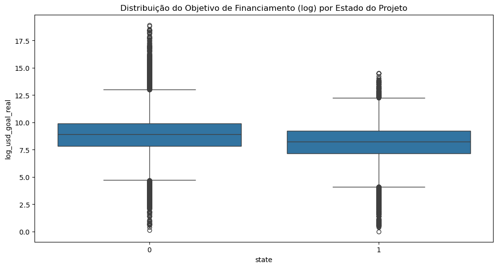
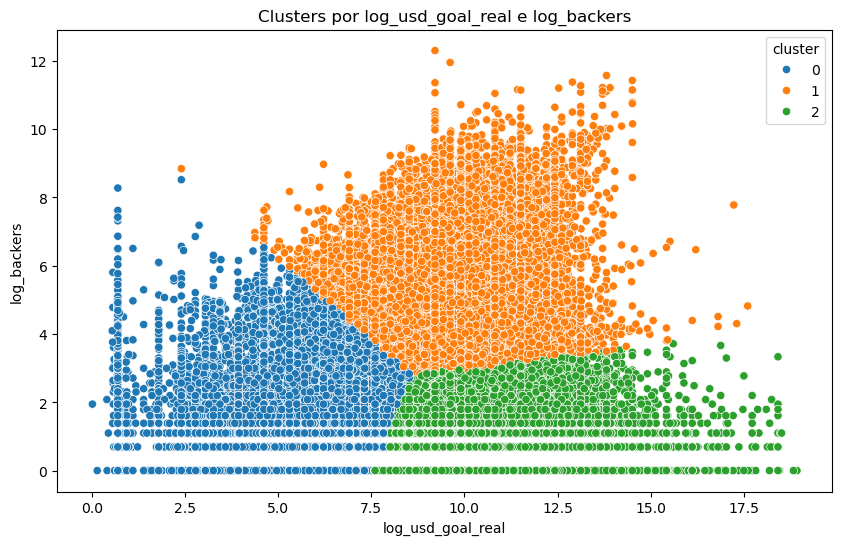

# KickStater MachineLearning Project


```python
import pandas as pd
import numpy as np
import matplotlib.pyplot as plt
import seaborn as sns

from sklearn.model_selection import train_test_split, GridSearchCV, cross_val_score
from sklearn.preprocessing import StandardScaler
from sklearn.decomposition import PCA
from sklearn.metrics import classification_report, confusion_matrix, roc_auc_score, RocCurveDisplay, roc_curve
from sklearn.pipeline import Pipeline
from xgboost import XGBClassifier
from imblearn.over_sampling import SMOTE
from sklearn.compose import ColumnTransformer
from sklearn.cluster import KMeans
import warnings
warnings.filterwarnings("ignore")
```


```python
df = pd.read_csv("csv/ks-projects-201801.csv")
df.head()
```


<div>
<style scoped>
    .dataframe tbody tr th:only-of-type {
        vertical-align: middle;
    }

    .dataframe tbody tr th {
        vertical-align: top;
    }

    .dataframe thead th {
        text-align: right;
    }
</style>
<table border="1" class="dataframe">
  <thead>
    <tr style="text-align: right;">
      <th></th>
      <th>ID</th>
      <th>name</th>
      <th>category</th>
      <th>main_category</th>
      <th>currency</th>
      <th>deadline</th>
      <th>goal</th>
      <th>launched</th>
      <th>pledged</th>
      <th>state</th>
      <th>backers</th>
      <th>country</th>
      <th>usd pledged</th>
      <th>usd_pledged_real</th>
      <th>usd_goal_real</th>
    </tr>
  </thead>
  <tbody>
    <tr>
      <th>0</th>
      <td>1000002330</td>
      <td>The Songs of Adelaide &amp; Abullah</td>
      <td>Poetry</td>
      <td>Publishing</td>
      <td>GBP</td>
      <td>2015-10-09</td>
      <td>1000.0</td>
      <td>2015-08-11 12:12:28</td>
      <td>0.0</td>
      <td>failed</td>
      <td>0</td>
      <td>GB</td>
      <td>0.0</td>
      <td>0.0</td>
      <td>1533.95</td>
    </tr>
    <tr>
      <th>1</th>
      <td>1000003930</td>
      <td>Greeting From Earth: ZGAC Arts Capsule For ET</td>
      <td>Narrative Film</td>
      <td>Film &amp; Video</td>
      <td>USD</td>
      <td>2017-11-01</td>
      <td>30000.0</td>
      <td>2017-09-02 04:43:57</td>
      <td>2421.0</td>
      <td>failed</td>
      <td>15</td>
      <td>US</td>
      <td>100.0</td>
      <td>2421.0</td>
      <td>30000.00</td>
    </tr>
    <tr>
      <th>2</th>
      <td>1000004038</td>
      <td>Where is Hank?</td>
      <td>Narrative Film</td>
      <td>Film &amp; Video</td>
      <td>USD</td>
      <td>2013-02-26</td>
      <td>45000.0</td>
      <td>2013-01-12 00:20:50</td>
      <td>220.0</td>
      <td>failed</td>
      <td>3</td>
      <td>US</td>
      <td>220.0</td>
      <td>220.0</td>
      <td>45000.00</td>
    </tr>
    <tr>
      <th>3</th>
      <td>1000007540</td>
      <td>ToshiCapital Rekordz Needs Help to Complete Album</td>
      <td>Music</td>
      <td>Music</td>
      <td>USD</td>
      <td>2012-04-16</td>
      <td>5000.0</td>
      <td>2012-03-17 03:24:11</td>
      <td>1.0</td>
      <td>failed</td>
      <td>1</td>
      <td>US</td>
      <td>1.0</td>
      <td>1.0</td>
      <td>5000.00</td>
    </tr>
    <tr>
      <th>4</th>
      <td>1000011046</td>
      <td>Community Film Project: The Art of Neighborhoo...</td>
      <td>Film &amp; Video</td>
      <td>Film &amp; Video</td>
      <td>USD</td>
      <td>2015-08-29</td>
      <td>19500.0</td>
      <td>2015-07-04 08:35:03</td>
      <td>1283.0</td>
      <td>canceled</td>
      <td>14</td>
      <td>US</td>
      <td>1283.0</td>
      <td>1283.0</td>
      <td>19500.00</td>
    </tr>
  </tbody>
</table>
</div>


```python
df.info()
```

    <class 'pandas.core.frame.DataFrame'>
    RangeIndex: 378661 entries, 0 to 378660
    Data columns (total 15 columns):
     #   Column            Non-Null Count   Dtype  
    ---  ------            --------------   -----  
     0   ID                378661 non-null  int64  
     1   name              378657 non-null  object 
     2   category          378661 non-null  object 
     3   main_category     378661 non-null  object 
     4   currency          378661 non-null  object 
     5   deadline          378661 non-null  object 
     6   goal              378661 non-null  float64
     7   launched          378661 non-null  object 
     8   pledged           378661 non-null  float64
     9   state             378661 non-null  object 
     10  backers           378661 non-null  int64  
     11  country           378661 non-null  object 
     12  usd pledged       374864 non-null  float64
     13  usd_pledged_real  378661 non-null  float64
     14  usd_goal_real     378661 non-null  float64
    dtypes: float64(5), int64(2), object(8)
    memory usage: 43.3+ MB
    

#  Pré-processamento dos Dados

## 1. Filtrar apenas os projetos que foram 'successful' ou 'failed'


```python
df = df[df['state'].isin(['successful', 'failed'])].copy()
```

## 2. Remover colunas irrelevantes para o modelo (ID, name, pledged redundante, etc.)


```python
df.drop(columns=[
    'ID', 'name', 'pledged', 'usd pledged'
], inplace=True)
```

## 3. Converter datas


```python
df['launched'] = pd.to_datetime(df['launched'])
df['deadline'] = pd.to_datetime(df['deadline'])

# Criar novas features de data (tempo de campanha)
df['campaign_days'] = (df['deadline'] - df['launched']).dt.days
df['launch_month'] = df['launched'].dt.month
df['launch_year'] = df['launched'].dt.year
```

## 4. Codificar variável alvo


```python
df['state'] = df['state'].map({'successful': 1, 'failed': 0})
```

## 5. Feature Engineering adicional (Tratar Outliers)


```python
df['goal_to_pledge_ratio'] = df['usd_pledged_real'] / df['usd_goal_real']
df['log_backers'] = np.log1p(df['backers'])
df['log_usd_goal_real'] = np.log1p(df['usd_goal_real'])
df['log_usd_pledged_real'] = np.log1p(df['usd_pledged_real'])
```

## 6. Codificar variáveis categóricas


```python
categorical = ['category', 'main_category', 'currency', 'country']
df = pd.get_dummies(df, columns=categorical)
```

## 7. Remover colunas redundantes


```python
df.drop(columns=['launched', 'deadline', 'backers', 'usd_goal_real', 'usd_pledged_real'], inplace=True)
```


```python
df.head()
```


<div>
<style scoped>
    .dataframe tbody tr th:only-of-type {
        vertical-align: middle;
    }

    .dataframe tbody tr th {
        vertical-align: top;
    }

    .dataframe thead th {
        text-align: right;
    }
</style>
<table border="1" class="dataframe">
  <thead>
    <tr style="text-align: right;">
      <th></th>
      <th>goal</th>
      <th>state</th>
      <th>campaign_days</th>
      <th>launch_month</th>
      <th>launch_year</th>
      <th>goal_to_pledge_ratio</th>
      <th>log_backers</th>
      <th>log_usd_goal_real</th>
      <th>log_usd_pledged_real</th>
      <th>category_3D Printing</th>
      <th>...</th>
      <th>country_JP</th>
      <th>country_LU</th>
      <th>country_MX</th>
      <th>country_N,0"</th>
      <th>country_NL</th>
      <th>country_NO</th>
      <th>country_NZ</th>
      <th>country_SE</th>
      <th>country_SG</th>
      <th>country_US</th>
    </tr>
  </thead>
  <tbody>
    <tr>
      <th>0</th>
      <td>1000.0</td>
      <td>0</td>
      <td>58</td>
      <td>8</td>
      <td>2015</td>
      <td>0.000000</td>
      <td>0.000000</td>
      <td>7.336253</td>
      <td>0.000000</td>
      <td>False</td>
      <td>...</td>
      <td>False</td>
      <td>False</td>
      <td>False</td>
      <td>False</td>
      <td>False</td>
      <td>False</td>
      <td>False</td>
      <td>False</td>
      <td>False</td>
      <td>False</td>
    </tr>
    <tr>
      <th>1</th>
      <td>30000.0</td>
      <td>0</td>
      <td>59</td>
      <td>9</td>
      <td>2017</td>
      <td>0.080700</td>
      <td>2.772589</td>
      <td>10.308986</td>
      <td>7.792349</td>
      <td>False</td>
      <td>...</td>
      <td>False</td>
      <td>False</td>
      <td>False</td>
      <td>False</td>
      <td>False</td>
      <td>False</td>
      <td>False</td>
      <td>False</td>
      <td>False</td>
      <td>True</td>
    </tr>
    <tr>
      <th>2</th>
      <td>45000.0</td>
      <td>0</td>
      <td>44</td>
      <td>1</td>
      <td>2013</td>
      <td>0.004889</td>
      <td>1.386294</td>
      <td>10.714440</td>
      <td>5.398163</td>
      <td>False</td>
      <td>...</td>
      <td>False</td>
      <td>False</td>
      <td>False</td>
      <td>False</td>
      <td>False</td>
      <td>False</td>
      <td>False</td>
      <td>False</td>
      <td>False</td>
      <td>True</td>
    </tr>
    <tr>
      <th>3</th>
      <td>5000.0</td>
      <td>0</td>
      <td>29</td>
      <td>3</td>
      <td>2012</td>
      <td>0.000200</td>
      <td>0.693147</td>
      <td>8.517393</td>
      <td>0.693147</td>
      <td>False</td>
      <td>...</td>
      <td>False</td>
      <td>False</td>
      <td>False</td>
      <td>False</td>
      <td>False</td>
      <td>False</td>
      <td>False</td>
      <td>False</td>
      <td>False</td>
      <td>True</td>
    </tr>
    <tr>
      <th>5</th>
      <td>50000.0</td>
      <td>1</td>
      <td>34</td>
      <td>2</td>
      <td>2016</td>
      <td>1.047500</td>
      <td>5.416100</td>
      <td>10.819798</td>
      <td>10.866204</td>
      <td>False</td>
      <td>...</td>
      <td>False</td>
      <td>False</td>
      <td>False</td>
      <td>False</td>
      <td>False</td>
      <td>False</td>
      <td>False</td>
      <td>False</td>
      <td>False</td>
      <td>True</td>
    </tr>
  </tbody>
</table>
<p>5 rows × 220 columns</p>
</div>


## --- Análise Exploratória com Gráficos ---


```python
plt.figure(figsize=(12, 6))
sns.boxplot(data=df, x='state', y='log_usd_goal_real')
plt.title('Distribuição do Objetivo de Financiamento (log) por Estado do Projeto')
plt.show()
```


    

    


No gráfico, percebemos que projetos fracassados (state = 0) tendem a pedir mais dinheiro (mediana um pouco mais alta), com uma cauda superior mais longa — ou seja, muitos projetos com objetivos bem ousados que acabam não sendo financiados.

Já os projetos bem-sucedidos (state = 1) têm metas mais modestas, sugerindo que pedir menos pode aumentar a chance de alcançar o sucesso.

Insight: Moderação no objetivo financeiro pode ser estratégica, sonhar alto é válido, mas planejar metas realistas parece ser um diferencial de sucesso no Kickstarter.


```python
plt.figure(figsize=(12, 6))
sns.violinplot(data=df, x='state', y='campaign_days')
plt.title("Dias de Campanha por Resultado")
plt.show()
```


    

    


Esse gráfico de violino revela uma paisagem curiosa: a maioria dos projetos bem-sucedidos e fracassados concentra-se em campanhas de 30 dias, formando um pico proeminente. Porém, observamos algumas campanhas que tentaram durar 60, 90 ou até mais dias, mas essas parecem igualmente presentes em ambos os grupos.

A distribuição é bastante parecida para ambos os estados, indicando que o tempo de campanha, por si só, não determina o sucesso. No entanto, o excesso de dias não parece garantir mais vitórias.

Insight: Tempo não é tudo, a eficácia da campanha em captar apoio logo nos primeiros dias pode ser mais determinante que sua duração total.


```python
plt.figure(figsize=(12, 6))
sns.histplot(data=df, x='launch_month', hue='state', multiple='stack', bins=12)
plt.title("Distribuição dos Lançamentos por Mês")
plt.show()
```


    

    


Março, Abril e Junho parecem ser meses com picos de lançamentos — talvez pela sazonalidade de planejamento de projetos e pelo fim do primeiro trimestre.

Curiosamente, o mês de Dezembro tem menos lançamentos e uma queda notável no sucesso dos projetos. Pode ser que, com os feriados, festas e foco em consumo natalino, as pessoas estejam menos inclinadas a apoiar novos projetos nesse período.

Insight: O calendário importa. Lançar um projeto nos meses de maior movimentação pode aumentar a visibilidade e engajamento. Evitar Dezembro pode ser uma escolha estratégica.

## KMeans Clustering em 2D


```python
kmeans_features = df[['log_usd_goal_real', 'log_backers']].copy()
kmeans = KMeans(n_clusters=3, random_state=42)
df['cluster'] = kmeans.fit_predict(kmeans_features)
```


```python
plt.figure(figsize=(10, 6))
sns.scatterplot(data=df, x='log_usd_goal_real', y='log_backers', hue='cluster', palette='tab10')
plt.title("Clusters por log_usd_goal_real e log_backers")
plt.show()
```


    

    


Neste gráfico, temos uma visualização clara de clusters formados com base no objetivo de financiamento (log) e número de apoiadores (log).

Cluster 0 (azul) agrupa projetos com baixo objetivo financeiro e número de apoiadores também baixo a moderado. É como se estivéssemos olhando para os projetos mais modestos da plataforma — ideias pequenas, com pouca ambição financeira e que não conseguiram grande tração entre os apoiadores.

Cluster 1 (laranja) representa uma região de sucesso promissor: objetivos financeiros medianos a altos, mas com um bom volume de apoiadores. Esse grupo parece o “coração do Kickstarter”, onde os projetos equilibram ambição com engajamento real da comunidade.

Cluster 2 (verde) chama atenção: altos objetivos financeiros, porém com poucos apoiadores. Este é o território dos “elefantes brancos” — projetos superambiciosos que não conseguem mobilizar apoio suficiente. Pode indicar ideias mal comunicadas, propostas irreais ou simplesmente fora da curva para o público da plataforma.


## Gráfico de Dispersão por Categoria


```python
if 'main_category_Games' in df.columns:
    df_plot = df.copy()
    df_plot['main_category'] = df_plot.filter(like='main_category_').idxmax(axis=1).str.replace('main_category_', '')
    plt.figure(figsize=(12, 6))
    sns.boxplot(data=df_plot, x='main_category', y='log_usd_goal_real', hue='state')
    plt.xticks(rotation=90)
    plt.title("Distribuição de Objetivo de Financiamento por Categoria e Estado")
    plt.tight_layout()
    plt.show()
```


    

    


Neste gráfico, observamos como o objetivo de financiamento (log) varia por categoria principal e estado do projeto (0 = fracasso, 1 = sucesso).

De modo geral, para quase todas as categorias, os projetos que fracassaram (azul) tendem a ter valores medianos e máximos mais altos do que os que tiveram sucesso (laranja). Isso sugere que pedir demais pode comprometer o sucesso.

Categorias como “Technology”, “Design” e “Games” mostram claramente metas financeiras mais altas — especialmente entre os projetos fracassados. Já categorias como “Art”, “Dance” e “Publishing” concentram projetos com metas mais modestas.

Um destaque interessante é que em categorias como “Music” e “Photography”, a diferença entre os projetos bem-sucedidos e fracassados é menor. Pode ser um indicativo de que nessas áreas, os criadores conhecem melhor o “ponto doce” de financiamento.

## 8. Definir X e y


```python
X = df.drop(columns=['state'])
y = df['state']
```

## 9. Balanceamento com SMOTE


```python
smote = SMOTE(random_state=42)
X_resampled, y_resampled = smote.fit_resample(X, y)
```

## 10. Treinamento com pipeline + escalonamento


```python
model = Pipeline([
    ('scaler', StandardScaler()),
    ('pca', PCA(n_components=0.95)),  # Mantém 95% da variância
    ('classifier', XGBClassifier(random_state=42, use_label_encoder=False, eval_metric='logloss'))
])
```

## 11. Avaliação com cross-validation


```python
scores = cross_val_score(model, X_resampled, y_resampled, cv=5, scoring='roc_auc')
print("Cross-Validated ROC AUC Scores:", scores)
print("Mean ROC AUC:", np.mean(scores))
```

    Cross-Validated ROC AUC Scores: [0.98955844 0.98884069 0.98956712 0.99519135 0.99721565]
    Mean ROC AUC: 0.9920746509887218
    

Esses valores de ROC AUC revelam um modelo extremamente eficaz na separação das classes (por exemplo, projetos de sucesso vs. fracasso no Kickstarter).

## 12. Treino/teste split e treino do modelo final


```python
X_train, X_test, y_train, y_test = train_test_split(X_resampled, y_resampled, test_size=0.2, random_state=42)
model.fit(X_train, y_train)
```


<style>#sk-container-id-1 {
  /* Definition of color scheme common for light and dark mode */
  --sklearn-color-text: black;
  --sklearn-color-line: gray;
  /* Definition of color scheme for unfitted estimators */
  --sklearn-color-unfitted-level-0: #fff5e6;
  --sklearn-color-unfitted-level-1: #f6e4d2;
  --sklearn-color-unfitted-level-2: #ffe0b3;
  --sklearn-color-unfitted-level-3: chocolate;
  /* Definition of color scheme for fitted estimators */
  --sklearn-color-fitted-level-0: #f0f8ff;
  --sklearn-color-fitted-level-1: #d4ebff;
  --sklearn-color-fitted-level-2: #b3dbfd;
  --sklearn-color-fitted-level-3: cornflowerblue;

  /* Specific color for light theme */
  --sklearn-color-text-on-default-background: var(--sg-text-color, var(--theme-code-foreground, var(--jp-content-font-color1, black)));
  --sklearn-color-background: var(--sg-background-color, var(--theme-background, var(--jp-layout-color0, white)));
  --sklearn-color-border-box: var(--sg-text-color, var(--theme-code-foreground, var(--jp-content-font-color1, black)));
  --sklearn-color-icon: #696969;

  @media (prefers-color-scheme: dark) {
    /* Redefinition of color scheme for dark theme */
    --sklearn-color-text-on-default-background: var(--sg-text-color, var(--theme-code-foreground, var(--jp-content-font-color1, white)));
    --sklearn-color-background: var(--sg-background-color, var(--theme-background, var(--jp-layout-color0, #111)));
    --sklearn-color-border-box: var(--sg-text-color, var(--theme-code-foreground, var(--jp-content-font-color1, white)));
    --sklearn-color-icon: #878787;
  }
}

#sk-container-id-1 {
  color: var(--sklearn-color-text);
}

#sk-container-id-1 pre {
  padding: 0;
}

#sk-container-id-1 input.sk-hidden--visually {
  border: 0;
  clip: rect(1px 1px 1px 1px);
  clip: rect(1px, 1px, 1px, 1px);
  height: 1px;
  margin: -1px;
  overflow: hidden;
  padding: 0;
  position: absolute;
  width: 1px;
}

#sk-container-id-1 div.sk-dashed-wrapped {
  border: 1px dashed var(--sklearn-color-line);
  margin: 0 0.4em 0.5em 0.4em;
  box-sizing: border-box;
  padding-bottom: 0.4em;
  background-color: var(--sklearn-color-background);
}

#sk-container-id-1 div.sk-container {
  /* jupyter's `normalize.less` sets `[hidden] { display: none; }`
     but bootstrap.min.css set `[hidden] { display: none !important; }`
     so we also need the `!important` here to be able to override the
     default hidden behavior on the sphinx rendered scikit-learn.org.
     See: https://github.com/scikit-learn/scikit-learn/issues/21755 */
  display: inline-block !important;
  position: relative;
}

#sk-container-id-1 div.sk-text-repr-fallback {
  display: none;
}

div.sk-parallel-item,
div.sk-serial,
div.sk-item {
  /* draw centered vertical line to link estimators */
  background-image: linear-gradient(var(--sklearn-color-text-on-default-background), var(--sklearn-color-text-on-default-background));
  background-size: 2px 100%;
  background-repeat: no-repeat;
  background-position: center center;
}

/* Parallel-specific style estimator block */

#sk-container-id-1 div.sk-parallel-item::after {
  content: "";
  width: 100%;
  border-bottom: 2px solid var(--sklearn-color-text-on-default-background);
  flex-grow: 1;
}

#sk-container-id-1 div.sk-parallel {
  display: flex;
  align-items: stretch;
  justify-content: center;
  background-color: var(--sklearn-color-background);
  position: relative;
}

#sk-container-id-1 div.sk-parallel-item {
  display: flex;
  flex-direction: column;
}

#sk-container-id-1 div.sk-parallel-item:first-child::after {
  align-self: flex-end;
  width: 50%;
}

#sk-container-id-1 div.sk-parallel-item:last-child::after {
  align-self: flex-start;
  width: 50%;
}

#sk-container-id-1 div.sk-parallel-item:only-child::after {
  width: 0;
}

/* Serial-specific style estimator block */

#sk-container-id-1 div.sk-serial {
  display: flex;
  flex-direction: column;
  align-items: center;
  background-color: var(--sklearn-color-background);
  padding-right: 1em;
  padding-left: 1em;
}


/* Toggleable style: style used for estimator/Pipeline/ColumnTransformer box that is
clickable and can be expanded/collapsed.
- Pipeline and ColumnTransformer use this feature and define the default style
- Estimators will overwrite some part of the style using the `sk-estimator` class
*/

/* Pipeline and ColumnTransformer style (default) */

#sk-container-id-1 div.sk-toggleable {
  /* Default theme specific background. It is overwritten whether we have a
  specific estimator or a Pipeline/ColumnTransformer */
  background-color: var(--sklearn-color-background);
}

/* Toggleable label */
#sk-container-id-1 label.sk-toggleable__label {
  cursor: pointer;
  display: block;
  width: 100%;
  margin-bottom: 0;
  padding: 0.5em;
  box-sizing: border-box;
  text-align: center;
}

#sk-container-id-1 label.sk-toggleable__label-arrow:before {
  /* Arrow on the left of the label */
  content: "▸";
  float: left;
  margin-right: 0.25em;
  color: var(--sklearn-color-icon);
}

#sk-container-id-1 label.sk-toggleable__label-arrow:hover:before {
  color: var(--sklearn-color-text);
}

/* Toggleable content - dropdown */

#sk-container-id-1 div.sk-toggleable__content {
  max-height: 0;
  max-width: 0;
  overflow: hidden;
  text-align: left;
  /* unfitted */
  background-color: var(--sklearn-color-unfitted-level-0);
}

#sk-container-id-1 div.sk-toggleable__content.fitted {
  /* fitted */
  background-color: var(--sklearn-color-fitted-level-0);
}

#sk-container-id-1 div.sk-toggleable__content pre {
  margin: 0.2em;
  border-radius: 0.25em;
  color: var(--sklearn-color-text);
  /* unfitted */
  background-color: var(--sklearn-color-unfitted-level-0);
}

#sk-container-id-1 div.sk-toggleable__content.fitted pre {
  /* unfitted */
  background-color: var(--sklearn-color-fitted-level-0);
}

#sk-container-id-1 input.sk-toggleable__control:checked~div.sk-toggleable__content {
  /* Expand drop-down */
  max-height: 200px;
  max-width: 100%;
  overflow: auto;
}

#sk-container-id-1 input.sk-toggleable__control:checked~label.sk-toggleable__label-arrow:before {
  content: "▾";
}

/* Pipeline/ColumnTransformer-specific style */

#sk-container-id-1 div.sk-label input.sk-toggleable__control:checked~label.sk-toggleable__label {
  color: var(--sklearn-color-text);
  background-color: var(--sklearn-color-unfitted-level-2);
}

#sk-container-id-1 div.sk-label.fitted input.sk-toggleable__control:checked~label.sk-toggleable__label {
  background-color: var(--sklearn-color-fitted-level-2);
}

/* Estimator-specific style */

/* Colorize estimator box */
#sk-container-id-1 div.sk-estimator input.sk-toggleable__control:checked~label.sk-toggleable__label {
  /* unfitted */
  background-color: var(--sklearn-color-unfitted-level-2);
}

#sk-container-id-1 div.sk-estimator.fitted input.sk-toggleable__control:checked~label.sk-toggleable__label {
  /* fitted */
  background-color: var(--sklearn-color-fitted-level-2);
}

#sk-container-id-1 div.sk-label label.sk-toggleable__label,
#sk-container-id-1 div.sk-label label {
  /* The background is the default theme color */
  color: var(--sklearn-color-text-on-default-background);
}

/* On hover, darken the color of the background */
#sk-container-id-1 div.sk-label:hover label.sk-toggleable__label {
  color: var(--sklearn-color-text);
  background-color: var(--sklearn-color-unfitted-level-2);
}

/* Label box, darken color on hover, fitted */
#sk-container-id-1 div.sk-label.fitted:hover label.sk-toggleable__label.fitted {
  color: var(--sklearn-color-text);
  background-color: var(--sklearn-color-fitted-level-2);
}

/* Estimator label */

#sk-container-id-1 div.sk-label label {
  font-family: monospace;
  font-weight: bold;
  display: inline-block;
  line-height: 1.2em;
}

#sk-container-id-1 div.sk-label-container {
  text-align: center;
}

/* Estimator-specific */
#sk-container-id-1 div.sk-estimator {
  font-family: monospace;
  border: 1px dotted var(--sklearn-color-border-box);
  border-radius: 0.25em;
  box-sizing: border-box;
  margin-bottom: 0.5em;
  /* unfitted */
  background-color: var(--sklearn-color-unfitted-level-0);
}

#sk-container-id-1 div.sk-estimator.fitted {
  /* fitted */
  background-color: var(--sklearn-color-fitted-level-0);
}

/* on hover */
#sk-container-id-1 div.sk-estimator:hover {
  /* unfitted */
  background-color: var(--sklearn-color-unfitted-level-2);
}

#sk-container-id-1 div.sk-estimator.fitted:hover {
  /* fitted */
  background-color: var(--sklearn-color-fitted-level-2);
}

/* Specification for estimator info (e.g. "i" and "?") */

/* Common style for "i" and "?" */

.sk-estimator-doc-link,
a:link.sk-estimator-doc-link,
a:visited.sk-estimator-doc-link {
  float: right;
  font-size: smaller;
  line-height: 1em;
  font-family: monospace;
  background-color: var(--sklearn-color-background);
  border-radius: 1em;
  height: 1em;
  width: 1em;
  text-decoration: none !important;
  margin-left: 1ex;
  /* unfitted */
  border: var(--sklearn-color-unfitted-level-1) 1pt solid;
  color: var(--sklearn-color-unfitted-level-1);
}

.sk-estimator-doc-link.fitted,
a:link.sk-estimator-doc-link.fitted,
a:visited.sk-estimator-doc-link.fitted {
  /* fitted */
  border: var(--sklearn-color-fitted-level-1) 1pt solid;
  color: var(--sklearn-color-fitted-level-1);
}

/* On hover */
div.sk-estimator:hover .sk-estimator-doc-link:hover,
.sk-estimator-doc-link:hover,
div.sk-label-container:hover .sk-estimator-doc-link:hover,
.sk-estimator-doc-link:hover {
  /* unfitted */
  background-color: var(--sklearn-color-unfitted-level-3);
  color: var(--sklearn-color-background);
  text-decoration: none;
}

div.sk-estimator.fitted:hover .sk-estimator-doc-link.fitted:hover,
.sk-estimator-doc-link.fitted:hover,
div.sk-label-container:hover .sk-estimator-doc-link.fitted:hover,
.sk-estimator-doc-link.fitted:hover {
  /* fitted */
  background-color: var(--sklearn-color-fitted-level-3);
  color: var(--sklearn-color-background);
  text-decoration: none;
}

/* Span, style for the box shown on hovering the info icon */
.sk-estimator-doc-link span {
  display: none;
  z-index: 9999;
  position: relative;
  font-weight: normal;
  right: .2ex;
  padding: .5ex;
  margin: .5ex;
  width: min-content;
  min-width: 20ex;
  max-width: 50ex;
  color: var(--sklearn-color-text);
  box-shadow: 2pt 2pt 4pt #999;
  /* unfitted */
  background: var(--sklearn-color-unfitted-level-0);
  border: .5pt solid var(--sklearn-color-unfitted-level-3);
}

.sk-estimator-doc-link.fitted span {
  /* fitted */
  background: var(--sklearn-color-fitted-level-0);
  border: var(--sklearn-color-fitted-level-3);
}

.sk-estimator-doc-link:hover span {
  display: block;
}

/* "?"-specific style due to the `<a>` HTML tag */

#sk-container-id-1 a.estimator_doc_link {
  float: right;
  font-size: 1rem;
  line-height: 1em;
  font-family: monospace;
  background-color: var(--sklearn-color-background);
  border-radius: 1rem;
  height: 1rem;
  width: 1rem;
  text-decoration: none;
  /* unfitted */
  color: var(--sklearn-color-unfitted-level-1);
  border: var(--sklearn-color-unfitted-level-1) 1pt solid;
}

#sk-container-id-1 a.estimator_doc_link.fitted {
  /* fitted */
  border: var(--sklearn-color-fitted-level-1) 1pt solid;
  color: var(--sklearn-color-fitted-level-1);
}

/* On hover */
#sk-container-id-1 a.estimator_doc_link:hover {
  /* unfitted */
  background-color: var(--sklearn-color-unfitted-level-3);
  color: var(--sklearn-color-background);
  text-decoration: none;
}

#sk-container-id-1 a.estimator_doc_link.fitted:hover {
  /* fitted */
  background-color: var(--sklearn-color-fitted-level-3);
}
</style><div id="sk-container-id-1" class="sk-top-container"><div class="sk-text-repr-fallback"><pre>Pipeline(steps=[(&#x27;scaler&#x27;, StandardScaler()), (&#x27;pca&#x27;, PCA(n_components=0.95)),
                (&#x27;classifier&#x27;,
                 XGBClassifier(base_score=None, booster=None, callbacks=None,
                               colsample_bylevel=None, colsample_bynode=None,
                               colsample_bytree=None, device=None,
                               early_stopping_rounds=None,
                               enable_categorical=False, eval_metric=&#x27;logloss&#x27;,
                               feature_types=None, feature_weights=None,
                               gamma=None, grow_policy=None,
                               importance_type=None,
                               interaction_constraints=None, learning_rate=None,
                               max_bin=None, max_cat_threshold=None,
                               max_cat_to_onehot=None, max_delta_step=None,
                               max_depth=None, max_leaves=None,
                               min_child_weight=None, missing=nan,
                               monotone_constraints=None, multi_strategy=None,
                               n_estimators=None, n_jobs=None,
                               num_parallel_tree=None, ...))])</pre><b>In a Jupyter environment, please rerun this cell to show the HTML representation or trust the notebook. <br />On GitHub, the HTML representation is unable to render, please try loading this page with nbviewer.org.</b></div><div class="sk-container" hidden><div class="sk-item sk-dashed-wrapped"><div class="sk-label-container"><div class="sk-label fitted sk-toggleable"><input class="sk-toggleable__control sk-hidden--visually" id="sk-estimator-id-1" type="checkbox" ><label for="sk-estimator-id-1" class="sk-toggleable__label fitted sk-toggleable__label-arrow fitted">&nbsp;&nbsp;Pipeline<a class="sk-estimator-doc-link fitted" rel="noreferrer" target="_blank" href="https://scikit-learn.org/1.4/modules/generated/sklearn.pipeline.Pipeline.html">?<span>Documentation for Pipeline</span></a><span class="sk-estimator-doc-link fitted">i<span>Fitted</span></span></label><div class="sk-toggleable__content fitted"><pre>Pipeline(steps=[(&#x27;scaler&#x27;, StandardScaler()), (&#x27;pca&#x27;, PCA(n_components=0.95)),
                (&#x27;classifier&#x27;,
                 XGBClassifier(base_score=None, booster=None, callbacks=None,
                               colsample_bylevel=None, colsample_bynode=None,
                               colsample_bytree=None, device=None,
                               early_stopping_rounds=None,
                               enable_categorical=False, eval_metric=&#x27;logloss&#x27;,
                               feature_types=None, feature_weights=None,
                               gamma=None, grow_policy=None,
                               importance_type=None,
                               interaction_constraints=None, learning_rate=None,
                               max_bin=None, max_cat_threshold=None,
                               max_cat_to_onehot=None, max_delta_step=None,
                               max_depth=None, max_leaves=None,
                               min_child_weight=None, missing=nan,
                               monotone_constraints=None, multi_strategy=None,
                               n_estimators=None, n_jobs=None,
                               num_parallel_tree=None, ...))])</pre></div> </div></div><div class="sk-serial"><div class="sk-item"><div class="sk-estimator fitted sk-toggleable"><input class="sk-toggleable__control sk-hidden--visually" id="sk-estimator-id-2" type="checkbox" ><label for="sk-estimator-id-2" class="sk-toggleable__label fitted sk-toggleable__label-arrow fitted">&nbsp;StandardScaler<a class="sk-estimator-doc-link fitted" rel="noreferrer" target="_blank" href="https://scikit-learn.org/1.4/modules/generated/sklearn.preprocessing.StandardScaler.html">?<span>Documentation for StandardScaler</span></a></label><div class="sk-toggleable__content fitted"><pre>StandardScaler()</pre></div> </div></div><div class="sk-item"><div class="sk-estimator fitted sk-toggleable"><input class="sk-toggleable__control sk-hidden--visually" id="sk-estimator-id-3" type="checkbox" ><label for="sk-estimator-id-3" class="sk-toggleable__label fitted sk-toggleable__label-arrow fitted">&nbsp;PCA<a class="sk-estimator-doc-link fitted" rel="noreferrer" target="_blank" href="https://scikit-learn.org/1.4/modules/generated/sklearn.decomposition.PCA.html">?<span>Documentation for PCA</span></a></label><div class="sk-toggleable__content fitted"><pre>PCA(n_components=0.95)</pre></div> </div></div><div class="sk-item"><div class="sk-estimator fitted sk-toggleable"><input class="sk-toggleable__control sk-hidden--visually" id="sk-estimator-id-4" type="checkbox" ><label for="sk-estimator-id-4" class="sk-toggleable__label fitted sk-toggleable__label-arrow fitted">&nbsp;XGBClassifier<a class="sk-estimator-doc-link fitted" rel="noreferrer" target="_blank" href="https://xgboost.readthedocs.io/en/release_3.0.0/python/python_api.html#xgboost.XGBClassifier">?<span>Documentation for XGBClassifier</span></a></label><div class="sk-toggleable__content fitted"><pre>XGBClassifier(base_score=None, booster=None, callbacks=None,
              colsample_bylevel=None, colsample_bynode=None,
              colsample_bytree=None, device=None, early_stopping_rounds=None,
              enable_categorical=False, eval_metric=&#x27;logloss&#x27;,
              feature_types=None, feature_weights=None, gamma=None,
              grow_policy=None, importance_type=None,
              interaction_constraints=None, learning_rate=None, max_bin=None,
              max_cat_threshold=None, max_cat_to_onehot=None,
              max_delta_step=None, max_depth=None, max_leaves=None,
              min_child_weight=None, missing=nan, monotone_constraints=None,
              multi_strategy=None, n_estimators=None, n_jobs=None,
              num_parallel_tree=None, ...)</pre></div> </div></div></div></div></div></div>


## 13. Avaliação do modelo final


```python
y_pred = model.predict(X_test)
print("Classification Report:\n", classification_report(y_test, y_pred))
print("Confusion Matrix:\n", confusion_matrix(y_test, y_pred))
print("ROC AUC:", roc_auc_score(y_test, y_pred))
```

    Classification Report:
                   precision    recall  f1-score   support
    
               0       0.97      0.95      0.96     39502
               1       0.95      0.97      0.96     39586
    
        accuracy                           0.96     79088
       macro avg       0.96      0.96      0.96     79088
    weighted avg       0.96      0.96      0.96     79088
    
    Confusion Matrix:
     [[37447  2055]
     [ 1228 38358]]
    ROC AUC: 0.9584781247749047
    

O modelo é balanceado, com desempenho quase simétrico nas duas classes.

Acurácia geral: 96%, com média ponderada (weighted avg) excelente.

Alta precisão e recall indicam que tanto os falsos positivos quanto os falsos negativos são baixos.

## Curva ROC


```python
y_proba = model.named_steps['classifier'].predict_proba(model.named_steps['pca'].transform(
    model.named_steps['scaler'].transform(X_test)))[:, 1]

fpr, tpr, _ = roc_curve(y_test, y_proba)
plt.figure(figsize=(8, 6))
plt.plot(fpr, tpr, label=f'ROC AUC = {roc_auc_score(y_test, y_proba):.2f}')
plt.plot([0, 1], [0, 1], 'k--')
plt.xlabel("False Positive Rate")
plt.ylabel("True Positive Rate")
plt.title("Curva ROC")
plt.legend()
plt.grid()
plt.show()
```


    

    


A Curva ROC e a AUC indicam a capacidade de separação do modelo:

AUC = 0.99 na imagem e 0.958 no texto (possível divergência de testes).

Em ambos os casos, a curva está muito acima da linha de base (45°), mostrando que o modelo é excelente para separar as classes.

Quanto mais próximo de 1, melhor o desempenho. Acima de 0.95 já é considerado excelente.

## Validação cruzada com ROC AUC


```python
scaler = StandardScaler()
X_scaled = scaler.fit_transform(X_resampled)
pca_temp = PCA().fit(X_scaled)

plt.figure(figsize=(10, 6))
plt.plot(np.cumsum(pca_temp.explained_variance_ratio_))
plt.xlabel('Número de Componentes')
plt.ylabel('Variância Explicada Acumulada')
plt.title('Escolha do Número de Componentes (PCA)')
plt.grid(True)
plt.show()
```


    

    


Esse gráfico mostra a variância explicada acumulada em função do número de componentes principais. Observações:

A curva cresce rapidamente até cerca de 30 a 40 componentes, o que sugere que a maior parte da variância é capturada nas primeiras componentes.

Depois disso, a curva tende a uma reta quase linear até estabilizar em 1, indicando diminuição no ganho de informação ao incluir mais componentes.

Decisão prática: usar ~30-50 componentes pode ser um bom equilíbrio entre desempenho e redução de dimensionalidade.

## Conclusão

Reduz dimensionalidade com eficiência (via PCA).

Tem excelente capacidade discriminativa (AUC alto).

Mantém um equilíbrio forte entre precisão e recall.

Tem alta acurácia e erros mínimos.
